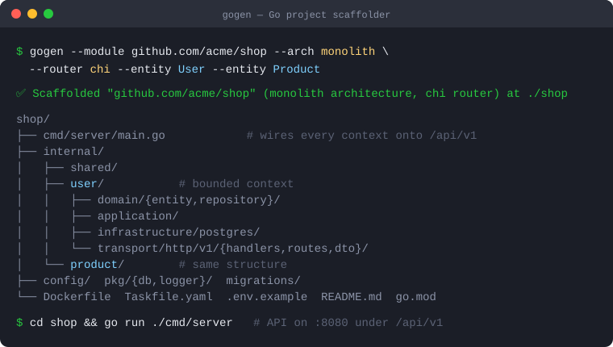

# 🚀 gogen — Go project scaffolder

[](https://golang.org)
[](LICENSE)

A CLI that scaffolds **compiling, production-shaped Go backends** in the
architecture you pick. One flag (`--arch`) switches between five layouts —
from a flat prototype to a DDD modular monolith — with a selectable HTTP router
(`gin`/`chi`) and database (`postgres`).

<p align="center">
  
</p>

## ✨ What you get

- **5 architectures** via `--arch`: `simple`, `layered`, `clean`,
  `microservice`, `monolith`.
- **Router choice**: `--router gin` (default) or `--router chi`.
- **Multi-entity**: repeat `--entity` to scaffold several resources at once.
- **Optional auth**: `--auth` adds a self-contained JWT + RBAC module
  (register/login/refresh, roles & permissions, auth middleware) to any
  structured architecture.
- **Optional frontend**: `--frontend html|htmx|react` makes it fullstack — the
  Go binary serves the frontend itself (embedded static assets, or an embedded
  built Vite/React app with SPA fallback).
- **Compiles out of the box**: every generated project passes `go build ./...`.
- **Production-grade DDD archs**: `clean`/`microservice`/`monolith` get a DI
  container, a router package with middleware, `pkg/response` + `pkg/validator`,
  domain errors, layered `configs/`, and `cmd/migrator` + `cmd/seed` binaries.
- **Batteries**: Viper config (`configs/config.yaml` + env overrides), structured
  logging via `pkg/logger` (**zap** + **lumberjack** file rotation, wired through
  main/services/handlers), Dockerfile, Taskfile, `.env.example`, `.gitignore`,
  and `pkg/db` (Postgres). Microservice adds healthcheck, graceful shutdown, a
  gRPC server stub, and `docker-compose.yml`.

## 🏁 Quick start

```bash
go build -o gogen ./cmd/gogen

# Clean architecture (default), gin, two entities
./gogen --module github.com/you/shop --arch clean --entity User --entity Product

cd shop && go run ./cmd/server   # API served under /api/v1
```

## 🖥️ Web UI

Prefer a browser? Start the local configurator:

```bash
gogen serve            # opens http://127.0.0.1:7720 (auto-picks a free port if taken)
gogen serve --port 9000
```

Pick the architecture, router, database and entities, watch the **structure
preview** update live, then **download the project as a `.zip`** (extract and run
`go mod tidy`). The server binds to `127.0.0.1` only and uses an uncommon default
port, falling back to a free OS-assigned port so it never clashes with other
services on your machine.

## 🧱 Architectures

| `--arch`       | Layout | Use it for |
|----------------|--------|------------|
| `simple`       | Flat `package main`; one file per entity with an in-memory store | Prototypes, demos, small tools |
| `layered`      | `cmd/server` + `internal/{model,repository,service,handler}` | Classic N-tier CRUD services |
| `clean`        | `internal/{domain,application,infrastructure,transport}` | Hexagonal single service |
| `microservice` | `clean` + gRPC, `/healthz`, graceful shutdown, docker-compose | Independently deployable service |
| `monolith`     | One bounded context per entity under `internal/<entity>/` | DDD modular monolith, single binary |

## 🛠️ Flags

| Flag | Default | Description |
|------|---------|-------------|
| `--module` | `github.com/username/project` | Go module path (project dir = last segment) |
| `--arch` | `clean` | `simple` \| `layered` \| `clean` \| `microservice` \| `monolith` |
| `--router` | `gin` | `gin` \| `chi` |
| `--db` | `postgres` | Database driver |
| `--entity` | `Item` | Resource name; repeatable (`--entity User --entity Order`) |
| `--auth` | `false` | Add a JWT + RBAC auth module (`internal/auth`); not for `--arch simple` |
| `--frontend` | `none` | Frontend layer served by the Go app: `none` \| `html` \| `htmx` \| `react` |

A leading `new` subcommand is accepted too: `gogen new --module ... --arch monolith`.

See the full reference in [docs/cli.md](docs/cli.md).

## 📚 Documentation

| Doc | What's in it |
|-----|--------------|
| [docs/architectures.md](docs/architectures.md) | Every layout explained, with generated trees and dependency rules |
| [docs/cli.md](docs/cli.md) | Full flag reference and copy-paste examples |
| [docs/development.md](docs/development.md) | Internals, how generation flows, and how to add an architecture |
| [CHANGELOG.md](CHANGELOG.md) | Notable changes |

## 🧩 How it works

Each architecture is a **declarative blueprint** — a `Build(cfg)` function in
[`internal/blueprint`](internal/blueprint) that returns the list of files to
generate. A small, shared set of [`templates/`](templates) (entity, repository,
service, handler, routes, …) is rendered with per-architecture import paths, so
the same template produces correct code in every layout.

```
cmd/gogen        → entry point
internal/cli     → flag parsing + validation
internal/blueprint → one file per architecture (simple, layered, clean, microservice, monolith)
internal/template  → renderer + shared Data/Imports + helper funcs
internal/generator → blueprint → render files → go mod init/tidy
internal/logx    → gogen's own zap logger (level via GOGEN_LOG)
internal/server  → `gogen serve` server (preview API + zip export)
web/             → UI assets (index.html), embedded via embed.go
templates/       → reusable text/templates
```

### Adding an architecture

1. Add `templates/main_<name>.tmpl` (and any layout-specific templates).
2. Add `internal/blueprint/<name>.go` with a `build<Name>(cfg)` function.
3. Register it in `Registry` and add `"<name>"` to `cli.Architectures`.

## 🔧 Development

```bash
go build ./...     # build the tool
go test ./...      # unit tests + per-arch parse checks
task run           # generate an example project
```

## 📝 License

MIT — see [LICENSE](LICENSE).
